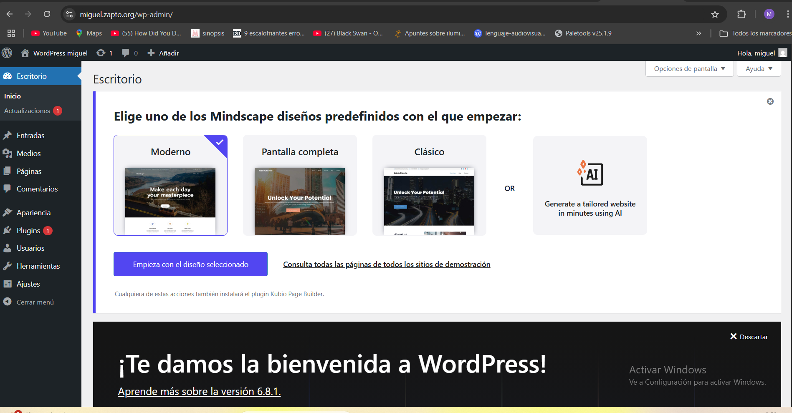

# practica-3.2
En esta práctica vamos a realizar la instalación de wordpress en 3 niveles mediante ansible.vamos a necesitar 5 maquinas:
 2 FRONTALES
 1 BACKEND
 1 BALANCEADOR
 1 SERVIDOR NFS

 Tendremos un inventario con el siguiente contenido:
````
 [frontend1]
172.31.29.190
[frontend2]
172.31.25.104
[backend]
172.31.26.94
[loadbalancer]
172.31.26.170
[nfs_server]
172.31.24.128

[all:vars]
ansible_user=ubuntu
ansible_ssh_private_key_file=/home/ubuntu/recuperacion2.pem
ansible_ssh_common_args='-o StrictHostKeyChecking=accept-new'
````

Los script que usaremos son los siguiente:

Configuracion de la pila LAMP para Frontend y Backend
- Configuracion del balanceador de carga
- Instalación de certificado
- Instalación de la base de datos Wordpress en el Backend
- Desscarga y configuración de Wordpress en los Frontales
- configuracion de servidor NFS y los clientes NFS

Una vez configurado el inventario podremos ejecutar el archivo main.yml,para tirar todos nuestros playbooks.

## comprobaciones.




